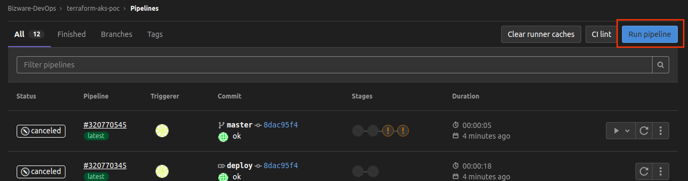

# AKS POC

En este terraform se encuentra el codigo para desplegar un cluster de aks de un solo nodo, este puede ser desplegado mediante CI/CD con gitlab.

## Aplicaciones

El cluster cuenta con aplicaciones bases para la demostracion a clientes, estas son desplegadas con helm providers (/modules/helm), las aplicaciones desplegadas son las siguientes:

* Prometheus + grafana
* Kibana + ElasticSearch
* Nginx Ingress Controller (El cual despliega un balanceador de carga el cual tiene una IP)
* Aplicacion Simple de Reactjs

## Utilizar aplicaciones

Para poder ver las aplicaciones instaladas es necesario Obtener la IP publica del balanceador y agregar los virtual host en la tabla de host de tu maquina personal, los host de cada aplicacion son los siguientes:

aks-app.testing
aks-grafana.testing
aks-kibana.testing

Ejemplo: si se trabaja con linux se debe modificar /etc/hosts (Modificar IP por la del balanceador desplegado)

```
13.64.93.xx aks-app.testing
13.64.93.xx aks-grafana.testing
13.64.93.xx aks-kibana.testing
```
## Despliegue de Infraestructura

Para desplegar la infraestructura, es necesario ejecutar un pipeline sobre la rama master. 

Para esto es necesario estar en el proyecto de gitlab, en el menu de la izquierda en la seccion CI/CD -> Pipelines.


veremos un listado de pipelines y solo necesitaremos crear un nuevo pipeline en el boton Run Pipeline, y seleccionamos que se ejecute sobre la rama master.



Con esto comenzara el proceso del pipeline con 4 stages, los dos primeros son automaticos, y los ultimos dos son manuales:


* **Validate**: verifica que los archivos de terraform no contengan errores de sintaxis, este es un paso automatico.

* **Plan**: corre el plan de terraform, este nos indica que y cuantos recursos se crearan con este despliegue, este es un paso automatico.

* **Apply**: Este es un paso manual debemos dar al play, al correr este stage, se realizara el despliegue en azure de bizware en el resource group **aks-poc**

* **Destroy**: Este es un paso manual debemos dar al play, al terminar de utilizar la POC, se debe ejecutar este stage para destruir todos los recursos creados.


## Utilizar autocannon

autocannon es una libreria de npmjs [autocannon](https://www.npmjs.com/package/autocannon), la cual nos permite simular peticiones http y https segun los parametros que les asignemos.

Para utilizar esta libreria y probar el autoescalado del Pod necesitamos los siguientes prerequisitos:

* Clonar este proyecto en tu maquina local
* Instalar Node (Doc para [Instalar](https://nodejs.org/es/))
* Ejecutar los siguientes comandos:

```
$: cd autocannon
$: npm install
$: node index.js
```


# Utilizar kubectl como administrador de AKS

Para entrar a la administracion del cluster sera necesario contar con una cuenta que posea permisos sobre el cluster de aks desplegado y cumplir con los siguientes requesitos:

* Instalar ["Azure CLI"](https://docs.microsoft.com/en-us/cli/azure/install-azure-cli)
* Logearse con su cuenta [Sign In](https://docs.microsoft.com/en-us/cli/azure/authenticate-azure-cli)

## Obtener las credenciales del cluster 

az aks get-credentials --name aks-poc --resource-group aks-poc --subscription {subscription_id} -f ~/.kube/config